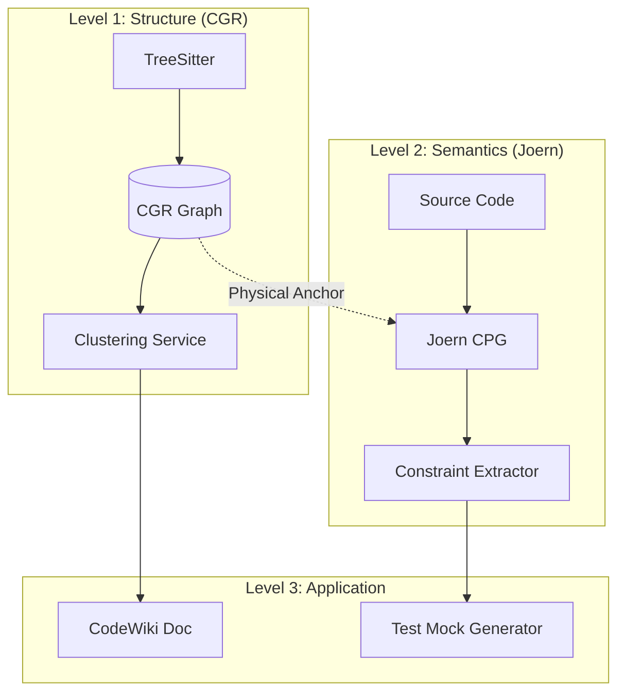

# Research Report: CodeWiki, CGR, and Joern Integration Strategies

## 1. Executive Summary
This report analyzes the feasibility of replacing CodeWiki's current clustering with `code-graph-rag` (CGR) and the potential value add of integrating `Joern`.

**Key Verdicts:**
1.  **CGR Replacement:** Yes, CGR's schema is superior to CodeWiki's ad-hoc graph and can serve as the robust data foundation for clustering.
2.  **Joern Value:** Currently near zero in implementation, but theoretically high. It bridges the gap between "Structure" (Types) and "Behavior" (Flow), which is critical for tasks like Mock Generation.
3.  **Mocking Capabilities:** Joern + Graph can provide *structural* and *constraint-based* mocking (80%), but likely still needs an LLM for *data realism* (20%).

---

## 2. In-Depth Analysis

### Q1: Can `code-graph-rag` (CGR) replace CodeWiki's clustering?

**Answer: Yes, and it should.**

**Current CodeWiki State (`graph_clustering.py`):**
-   **Method:** Ad-hoc construction of a `networkx.DiGraph` from a loose dictionary of components.
-   **Algorithm:** Greedy Modularity Communities (`community.louvain`).
-   **Weakness:** The "Graph Construction" and "Clustering Algorithm" are tightly coupled. The graph is built on the fly and discarded.
-   **Fallback:** Paradoxically falls back to file paths if the graph is empty, which defeats the purpose of semantic clustering.

**CGR Capability (`schemas.py`):**
-   **Schema:** Clearly defined, typed properties (`FUNCTION`, `CLASS`, `CALLS`, `IMPORTS`).
-   **Data Quality:** Validation via Pydantic ensures the graph is well-formed before any algorithm sees it.
-   **Strategy:**
    -   Treat CGR as the **Data Layer**.
    -   Treat Clustering as a **Service** on top of CGR.
    -   **Benefit:** You stop maintaining a fragile "parser" in CodeWiki and switch to consuming a "queryable graph" from CGR.

### Q2: How much information does Joern + Graph actually add?

**Answer: Potentially massive, but currently unused.**

**Code Analysis [`hybrid_analysis_service.py`]:**
-   **Current Impl:** The function `_extract_data_flows_for_functions` literally contains a `pass` statement (Line 200).
-   **Current Gain:** Zero. The current "Hybrid" service is purely aspirational.
-   **Potential Gain:**
    1.  **Call Graph Resolution:** Tree-Sitter guesses calls based on names. Joern resolves them based on types (e.g., handling polymorphism), which is crucial for accurate "Impact Analysis".
    2.  **Data Flow (Taint Analysis):** Joern can answer: *"Does user input at Controller A reach SQL Query B?"* Tree-Sitter cannot see this pass-through.
    3.  **Control Dependency:** Joern knows *conditions*. *"This function only calls X if Y is true."* This is vital for generating accurate test cases.

### Q3: How close is "Joern + Graph" to fully automated Test Mocks (No-LLM)?

**Answer: It provides the "Skeleton" and "Constraints", but lacks the "Flesh".**

**The Gap Analysis:**

| Feature | CGR (Tree-Sitter) | Joern (Program Analysis) | LLM (Generative) |
| :--- | :--- | :--- | :--- |
| **Mock Logic** | Knows function signature (`User getUser(int id)`) | Knows constraints (`id` must be > 0, returns object with `email` field) | Generates valid email format (e.g., "bob@example.com") |
| **Dependencies** | Knows `Service` depends on `DAO` | Knows `Service.method` calls `DAO.method` only on error path | Can interpret "business logic" descriptions |
| **Contribution** | **10%** (Structure) | **50%** (Logic/flow) | **40%** (Creative Data) |

**Conclusion:**
-   **Without LLM:** You can generate a *compilable* mock that satisfies the code's execution paths (e.g., passing a non-null object to avoid NPE).
-   **With LLM:** You use Joern to give the LLM the *exact constraints* ("I need an object that passes these 3 `if` checks"), preventing the LLM from hallucinating impossible scenarios.
-   **The "Killer" Feature:** Joern can tell you the **Reachable Definitions**. If testing `Function A`, Joern identifies exactly which 3 fields of the `BigConfigObject` are actually read, allowing you to generate a *minimal* mock instead of mocking the whole world.

## 3. Recommendation

**Phased Evolution:**

1.  **Phase 1 (The Clean Up):** Replace CodeWiki's ad-hoc parsing with CGR's `GraphUpdater`. Use CGR as the SSOT (Single Source of Truth) for the clustering algorithm.
2.  **Phase 2 (The Connector):** Implement the "Physical Anchor" (File + Byte Range) to link CGR nodes to Joern nodes reliably.
3.  **Phase 3 (The Brain):** Use Joern to export "Constraint Graphs" for critical functions. Feed these constraints to the LLM for high-precision Mock Generation.

**Architecture Diagram:**

